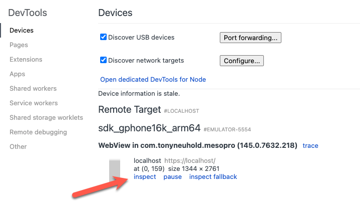

# 🏋️‍♀️ MesoPro 🏋️‍♀️

A workout tracking app.

## Architecture

### Styling

This was done originally with [this variant of shadcn](https://ui.shadcn.com/create?base=base&baseColor=zinc&theme=emerald&iconLibrary=tabler&template=start).

### Logging

Logging is done via Sentry. Configuration is setup in `hooks.client.ts` primarily.

### Auth

Sign-in with Google is configured via the [backend project and the OAuth configuration here in Google Cloud](https://console.cloud.google.com/auth/overview?project=backend-463900).

## Development

To start working on the project simply run:

- `pnpm dev` then navigate to the URL it shows in the terminal

### To use the backend locally

Modify the [localOverride.ts](src/util/localOverride.ts) file so that it is set to true.

### Adding new Components

Checkout the [shadcn-svelte site for what is available](https://shadcn-svelte.com/docs/components), and then run some variation of:

```
pnpm dlx shadcn-svelte@latest add COMPONENT-NAME
```

For the actual reference to the shadcn components, see them [here](https://ui.shadcn.com/docs/components).

### Icons

Icons are from [Tabler here](https://tabler.io/icons). Just import them from the `@tabler/icons-svelte` package.

### Adding new Routes

- Copy an existing route folder and modify

The reason that the `pageInfo.ts` files are separate and not done in the module context is that the module context is only available once the component is loaded for the first time. Because pageInfo is needed everywhere, it needs to be a separate file.

<details>
<summary><h3 style="display: inline">Android Development</h3></summary>

For first-time setup, you may need to add your local Android debug key to Google Cloud. See [the overview docs here for how the key-signing system + process for that works](docs/android-signing-and-google-sign-in.md).

#### Commands

- `pnpm dev:android` — runs hot-reloading for android. This is the only way at the moment to work with the local gcloud-backend if you want to do that via localOverrides. The prod build cannot hook into the local gcloud-backend. You don't need to use the localOverride though to use hot-reloading.
- `pnpm build:android` — production-style local build: `pnpm build` then `cap sync android`. Use this to verify the prod build path on-device against the prod backend.
- `pnpm open:android` — opens the Android project in Android Studio for native-side work (Gradle, manifest, signing, plugin config). For fine-grained control over permissions, edit [`AndroidManifest.xml`](android/app/src/main/AndroidManifest.xml) directly.

#### Testing on an emulator / debugging

1. If you want to test on your actual device, then plug it in first to the laptop at this point.
2. From the repo root, run `pnpm dev:android` and wait for the app to appear on the emulator. Note that you may need to change the device being used by updating the command. See the options in `scriptsComments`.
3. On your Mac, open Chrome and navigate to `chrome://inspect/#devices` This will bring up a view like so:



4. Interact with the app on the emulator / your phone while watching DevTools — JS errors, failed requests, and `console.*` output all surface there.

</details>
