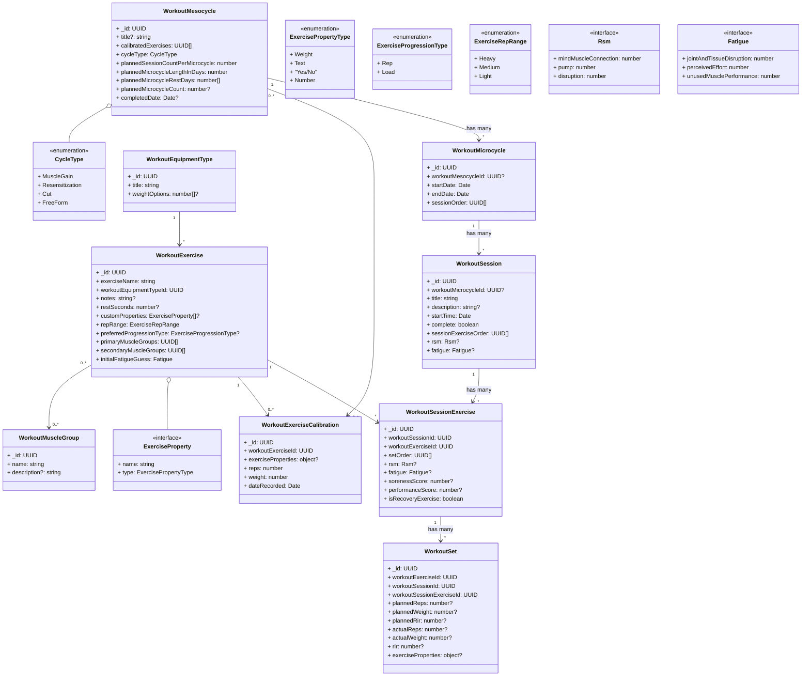

# MesoPro Data Model + System Description

Last copied from core-ts-db-lib: 2/7/2026

## Document Diagram

> Note: Where an interface is defined, and associated to a particular document, that is meant to be an embedded definition of the class that defines it. This is a limitation of mermaid, so imagine those interfaces as just an embedded object definition.

Model Notes:

- `WorkoutExercise` is meant to be specific to a particular way of doing an exercise. For example there should be separate exercises for Barbell Bench Press (Straight Sets), Barbell Bench Press (Myoreps), Dumbbell Bench Press (Straight Sets, Eccentric Focus, 3s Down, 1s Pause). It needs to be ultra specific, because even a different hand position will result in a different exercise, and should be tracked separately. This even includes the ExerciseRepRange, when all else would be exactly the same. Because of this, when creating a calibration, the UI should offer to add the same calibration (which would be duplicated), to another exercise.
- `WorkoutEquipmentType` is used to assist in algorithms where weight needs to be incremented or decremented for a schedule. But also helps dramatically to ease entering data for the user. This will be calculated in a view for the user where they can set a minimum weight (such as the bar) and possible increments, then the possible weights will be generated for them. Otherwise it is just a list of their dumbbell weights.
- `exerciseProperties` in `WorkoutSet` and `WorkoutExerciseCalibration` are populated from `WorkoutExercise.customProperties` at creation time. Then whenever customProperties are changed, they are changed among every single existing WorkoutSet with that WorkoutExercise linked to it.
- `calibratedExercises` in `WorkoutMesocycle` is an array of UUIDs referencing `WorkoutExerciseCalibration` documents. This locks which calibration was used for a mesocycle so historical 1RM values remain accurate even if calibrations are changed later. This is purposefully not an object with a reference to both the exercise and the calibration, because you can get the exercise from the calibration.
- `WorkoutExerciseCalibration` documents are meant to store the lowest amount of reps the person can do for that exercise with the highest amount of weight they can. See the section in the notes on 1RM calculations for more detail.
- `setOrder` on `WorkoutSession` was chosen as a compromise for querying efficiency in order to quickly get metrics like "Last time you did this exercise when it was preceded by these 4 other exercises, you did this".
- `restSeconds` on `WorkoutExercise` is used for a timer that will be built into the app for each exercise. No tracking will be done of the timer, it will be purely client-side.
- `WorkoutMesocycle.completedDate` should be set after the user gets a "success" completion screen of some kind and they have buttoned up any last prompts. This should guide them into the next mesocycle.
- `CycleType` when set to MuscleGain, Resensitization, or Cut means that automatic recommendations will be made. If it is set to FreeForm, then recommendations go away. FreeForm will not be selectable by the user, rather it is an escape hatch if something goes south during the mesocycle.

## Service Diagram

```mermaid
classDiagram
  class WorkoutSessionService {
    + getRsmTotal(session: WorkoutSession): number?
    + getFatigueTotal(session: WorkoutSession): number?
    + getSFR(session: WorkoutSession): number?
  }

  class WorkoutExerciseCalibrationService {
    + get1RM(calibration: WorkoutExerciseCalibration): number
    + getTargetWeight(calibration: WorkoutExerciseCalibration, targetReps: number, equipmentType: WorkoutEquipmentType): number
  }

  class WorkoutMesocycleService {
    + generateInitialPlan(mesocycle: WorkoutMesocycle, calibrations: WorkoutExerciseCalibration[], exercises: WorkoutExercise[], equipmentTypes: WorkoutEquipmentType[]): GenerateInitialPlanOutput
  }

  class GenerateInitialPlanOutput {
    <<interface>>
    + mesocycleUpdate: Partial~WorkoutMesocycle~?
    + microcycles: DocumentOperations~WorkoutMicrocycle~?
    + sessions: DocumentOperations~WorkoutSession~?
    + sessionExercises: DocumentOperations~WorkoutSessionExercise~?
    + sets: DocumentOperations~WorkoutSet~?
  }

  class DocumentOperations~T~ {
    <<interface>>
    + insert: T[]?
    + update: Partial~T~[]?
    + delete: UUID[]?
  }
```

Service Notes:

- `WorkoutMesocycleService.generateInitialPlan()` creates the complete default plan for a mesocycle before any user adjustments or feedback

## System Requirements

These are requirements that were developed after taking all the notes in the more educational sections in this markdown documents. So they are based on those notes above all else.

- The user should no longer get automatic recommendations if they make any of the following changes during a mesocycle. Automatic recommendations / planning will happen again upon starting a new mesocycle:
  - Reordering sessions within a mesocycle: The progression algorithm depends on soreness / performance per muscle group in order. Changing this makes the recommendations not mean much.
  - Changing exercises mid-mesocycle: This is breaking a cardinal rule in a way. We won't have baseline for load / volume progression, and can't track if we are making progress anymore.
  - Removing a muscle group assignment (or adding one) to exercises that are in a current mesocycle. This only matters if the muscle groups are being tracked. For example, if no exercise had rear delts assigned before, and suddenly it is added to an existing exercise that is being used, that shouldn't be a big deal. But if one is removed, like squats has quads removed, we lose an understanding of what is happening over the mesocycle.
  - Session frequency: This one sucks that it can't be changed after the mesocycle starts, but again, it comes down to tracking. If you need to do less sets, then the algorithm should reduce the sets for you. If you need to wait a few days before doing your next session because something came up, that should be okay too.
  - Skipping a session: Again, sucks that this can't be done, but same notes as above. If the time that was scheduled for a session has passed when the user opens the app back up, it should ask them if they want to move the session forward (within reason, such as a week), start a deload, or conclude that mesocycle for now. Otherwise, if they try to continue the workout, the workouts should be separated from a mesocycle, that way they aren't tied to a particular microcycle in a mesocycle progression for analytics purposes.
- The user should still get automatic recommendations if they do any of the following, the system should accommodate the user:
  - Move a session to a different day, as long as the order is maintained. If the number of rest days gets shorter though, then warn the user at least.
  - Doing something different than the expected reps / weight. This is a basic capability and the algorithm should be able to adjust as long as we have good RIR and fatigue values from the user. Might just give them a heads up that if they are getting too close to 0 RIR early on in a mesocycle, then they will burn out too fast to complete it.
  - Early deload: The system should be able to suggest if this needs to happen, so if the user does this explicitly, it should be just fine. No worries.
- The user should be able to track workouts outside of a mesocycle / microcycle. There is a reason that those foreign ID references are optional. There just won't be any automatic suggestions for the user. They can free-form as much as they like and use the app more like a workout tracker and not a plan builder. They can use individual sessions, and microcycles completely freely. Having a mesocycle is the determination if we use more advanced logic.

## Book Reference

[Here is a link to the NotebookLM notebook that has the book in it's source set](https://notebooklm.google.com/notebook/89ca292a-0f03-4f8d-a386-73ab8a048c0f) (There is a limit of 50 queries per day)

## Terms

- **Stimulus**: Stimulus is generally the amount of stress we are applying to a muscle over a particular time frame.
- **Delayed Onset Muscle Soreness (DOMS)**
- **Effective Stimulus Range** (pg 28-29): The effective stimulus range is the range between very low stimulus, and just after the amount of stimulus that causes peak muscle growth, just where more stimulus would start resulting in muscle loss.
- **Cell Swelling** (pg 26): "The Pump" 💪
- **Relative Effort** (pg 23): Relative Effort is a measure of how close to failure you are on a lift or how difficult the lift is for you with respect to your current capacity.
- **Reps in Reserve (RIR)** (pg 30): Reps in Reserve are the set's proximity to muscle failure. In other words, how many reps do you have left before you completely fail to produce the movement.
- **Effective Sets** (pg 33): Effective sets are a set that is done within 5-30 reps, and within 0-5 RIR.
- **Volume** (pg 34+): From page 34 and onwards, the book discusses volume as the number of effective sets. Even though this isn't the technical definition, everything averages out as long as you are using effective sets.
- **Minimum Effective Volume (MEV)** (pg. 34): The minimum volume which leads to muscle growth. This varies by age, training experience, and existing muscle mass. As you get stronger / bigger, this gets higher.
- **Maximum Recoverable Volume (MRV)** (pg. 34,117): The maximum volume that can be done before muscle loss begins.
- **Raw Stimulus Magnitude (RSM)** (pg. 50-53): RSM is the amount of muscle growth stimulus any given Workout Session gives.
- **Microcycle**: The shortest cycle of training that includes all workout sessions and rest days and is repeated. Typically, but not always, this is a week.
- **Mesocycle**: An organized sequence of microcycles ordered to elicit a set of distinct training adaptations. The typical mesocycle is composed of two distinct phases: an accumulation phase, and a shorter deload phase.
- **Stimulus to Fatigue Ratio (SFR)** (pg. 89,91-94): The relationship between stimulus and fatigue for any training input. This can be thought of as Hypertrophy Stimulated (proxied by RSM) / Fatigue Generated.
- **Stimulus, Recovery, and Adaptation (SRA)** (pg. 123): SRA dictates when we should stimulate and when we should recover for best adaptation.

## Key Concepts

### Training Stimulators (pg. 19-20)

The key stimulators at the cellular level that occur in response to training and are predictive of hypertrophy are:

- Tension
- Metabolite Accumulation
- Cell Swelling

During training, and while designing a program, we focus on the following stimulators, in order of importance, in order to cause the above 3 in the optimal way:

1. Tension
2. Volume
3. Relative Effort
4. Range of Motion (ROM)
5. Metabolite Accumulation
6. Cell Swelling
7. Mind-Muscle Connection
8. Movement Velocity
9. Muscle Damage

### Effective Reps (pg. 30-32)

The number of "effective reps" you have done are the number of reps between 5 RIR and 0 RIR. So if you got to 0 RIR, then you did 5 "effective reps". This is not to say that reps before 5 RIR are not useful, they are, just less so.

The catch to this is that lower RIR is much more fatigue, and in the grand scheme of things, always going to 0 RIR can cause muscle loss. So a more balanced average of 2-3 RIR is best.

Further, notable growth happens between 30% 1RM and 85% 1RM per repetition. Any less, doesn't give enough stimulus, any more and fatigue + injury risk increase exponentially. Note this is <u>per rep</u>, which means you must keep hitting that weight throughout the set. See the book for a further analysis, but this seems like the most key takeaway.

See Effective Sets for more info.

### Effective Sets (pg. 33,62,166-167)

Effective sets, are an extension of the effective reps, and basically widen the view a bit more. If only taking effective reps into account, one could conclude that a set with 2 RIR and one with 3 RIR is the same as one with 0 RIR. But that doesn't include the reps that were done before the effective reps. So overall the two sets will confer about twice the growth. More sets is virtually always better if they fit the parameters above and have at least 1 effective rep.

Sets anywhere between 5 - 30 reps are great, as long as they have at least 1 effective rep. Note that for mind-muscle connection, 10 - 20 reps is normally ideal for most people. Too little and you are straining too much too focus, too much and fatigue comes in which also doesn't help with focus. You can use this variation to your advantage for muscle groups and in a particular session. For example, the heavier sets are not practical at 30 reps, such as deadlifts, and it is generally unsafe to do enough weight to properly do 5 reps of flys. Because of this, I (personally) am making up a definition of "heavy", "medium", and "light" exercises. Which can be defined as:

- "Heavy exercises": Normally done in the 5-15 rep range
- "Medium exercises": Normally done in the 10-20 rep range (This should be the most common)
- "Light exercises": Normally done in the 15-30 rep range

You want to try and put the heavy exercises towards the beginning of the week if possible, and the lighter ones towards the end so that it is easier when your muscles are tired. But in general you also want to get the full range for each muscle group. This is part of the challenge with making a program. (pg. 166-167)

If you are trying to hit a target rep range of 10-20, and start at 16, 14, 12, 10, but need to add a fifth set the next week, it will need to be a drop set. So go down a bit of weight on the fifth set in order to keep your target reps of 10. (pg. 62)

Because of the averages and guidelines (roughly 2-3 RIR per set, and 5 - 30 reps per set), you can generally judge any workout program by the number effective sets in this way.

#### Checklist between Sets (pg. 39)

- Are my pecs still burning from the last set?
- Are my front delts and triceps ready to support my chest in another set?
- Do I feel mentally and physically like I can push hard with my chest again?
- Is my breathing more or less back to normal?

If you can answer yes on the recovery side for all of these, then you are good to go.

### Raw Stimulus Magnitude (RSM) (pg. 50-53)

RSM is the amount of muscle growth stimulus any given Workout Session gives. It is very well proxied by some combination of mind-muscle connection, pump, and disruption.

The following questions can quantify RSM for a given workout session, the results of which are valuable and can be used in various ways:

#### Mind Muscle Connection

On a scale of 0-3 how much did the training challenge your target muscles?

- 0: You felt barely aware of your target muscles during the exercise
- 1: You felt like your target muscles worked, but mildly
- 2: You felt a good amount of tension and/or burn in the target muscles
- 3: You felt tension and burn close to the limit in your target muscles

#### The Pump

On a scale of 0-3 how much pump did you experience in the target muscles?

- 0: You got no pump at all in the target muscles
- 1: You got a very mild pump in the target muscles
- 2: You got a decent pump in the target muscles
- 3: You got close to maximal pump in the target muscles

#### Muscle Disruption

On a scale of 0-3 how much did the training disrupt your target muscles?

- 0: You had no fatigue, perturbation, or soreness in the target muscles
- 1: You had some weakness and stiffness after the session in the target muscles, but recovered by the next day
- 2: You had weakness and stiffness after the session and experienced soreness the following day
- 3: You got much weaker and felt perturbation in the target muscles right after the session and also had soreness for a few days or more

#### Result

Add these scores together to get your RSM between 0-9.

### Mesocycles (pg. 58-61)

Mesocycles consist of two phases, the accumulation phase, and the shorter deload phase.

In general, DO NOT change exercises part way through a mesocycle. Not only does it prevent accurate tracking, but on page 174, it goes in depth that it can also prevent meaningful technique and load progression.

#### Accumulation Phase

The goal of this phase is to start at your MEV, and then progress towards your MRV. In order to do that, we need to know what your MEV is. The first time you will need to gauge this. But you may be able to go a few mesocycles before gauging it again. You can gauge it again whenever you like, or just use the data that you have recorded to project into the future.

To get your MEV, do the RSM calculation for the first 2-3 days of the mesocycle. Use that information to judge the following:

<!-- prettier-ignore -->
| Total Score | Proximity to MEV | Recommendation |
|---:|---|---|
| 0–1 | Stimulus likely below MEV | Increase volume the following week by two to four sets |
| 2–3 | Stimulus likely at or below MEV | Increase volume the following week by two to four sets |
| 4–6 | Stimulus likely at or just above MEV (a great place to start your mesocycle) | Progress normally |
| 7–9 | Stimulus likely between MEV and MRV, possibly exceeding MRV | Drop volume the following week |

After you get this information, go ahead and finish out the first week at MEV, then calculate how you should progress by answering the following questions:

On a scale of 0-3 how sore did you get in the target muscles?

- 0: You did not get at all sore in the target muscles
- 1: You got stiff for a few hours after training and had mild soreness in the target muscles that resolved by next session targeting the same muscles
- 2: You got DOMS in the target muscles that resolved just in time for the next session targeting the same muscles
- 3: You got DOMS in the target muscles that remained for the next session targeting the same muscles

On a scale of 0-3 how was your performance?

- 0: You hit your target reps, but either had to do 2 more reps than planned to hit target RIR or you hit your target reps at 2 or more reps before target RIR
- 1: You hit your target reps, but either had to do 0-1 more reps than planned to hit target RIR or you hit your target reps at 1 rep before target RIR
- 2: You hit your target reps after your target RIR
- 3: You could not match last week's reps at any RIR

Then use the following table to determine how many sets to add the next week generally, or if you need to employ recovery sessions.

<!-- prettier-ignore -->
| Soreness Score ↓ \ Performance Score → | 0 | 1 | 2 | 3 |
|---|---|---|---|---|
| **0** | Add 1–3 sets | Add 0–2 sets | Do not add sets | Employ recovery sessions (see Fatigue Management) |
| **1** | Add 1–2 sets | Add 0–1 sets | Do not add sets | Employ recovery sessions (see Fatigue Management) |
| **2** | Do not add sets | Do not add sets | Do not add sets | Employ recovery sessions (see Fatigue Management) |
| **3** | Do not add sets | Do not add sets | Do not add sets | Employ recovery sessions (see Fatigue Management) |

> The overall goal should be on set progression. Try not to increase load too much unless you really need to. Volume will give you more results than load as far as muscle growth.

You should have at least 4 weeks as your goal for the accumulation phase, and at the very most, 8 weeks. You know it's time to stop and go into deload when you are hitting 0 RIR, 85% 1RM. (pg. 184)

As far as an initial calculation, before adjustments are introduced, you want to begin volume at 2-4 sets per muscle group per session (starting at 2 sets if no data exists), and project an increase of 1-2 sets per muscle group per week. If literally no data exists, then an increase of 1 set per week is great. As far as rep range, it ends up being pretty basic. You use the target rep range for that exercise (for example, a "Heavy" exercise is 5-15), then use the RIR. So in week 1, and a heavy exercise, this will always be a target of 11 reps for the first set where the load uses the targetPercentage formula, targeting 15 reps for the first set, then use the same weight for the subsequent sets.

The user can choose how they want to progress between two types of progression for a particular exercise:

- Load Progression: Add the lowest increment available for the weight that the exercise uses each week, within reason. Like if someone is lifting 300lbs, then perhaps increase by 10 lbs instead of 5lbs. A good rule of thumb is if the weight increase is less than 2% of the overall weight, then use the next higher increment available to get at, or above a 2% increase in the weight.
- Rep Progression (Default): Add 2 reps per week to each set that is being executed. The reps should be above the previous week's by 2 once data starts coming in. Don't adjust the weight unless the target reps goes above the maximum for that exercise, in which case increase by the lowest increment available.

So, with this in mind, the default projection might look like this:

- Week 1: 4 RIR, 2 sets per exercise
- Week 2: 3 RIR, 3 sets for the first exercise / session for each muscle group, and 2 sets for each subsequent exercise for that muscle group / session (if there's more than 1)
- Week 3: 2 RIR, 3 sets for the first + second exercise for each muscle group, or 4 sets if there's only 1 exercise for that session
- Week 4: 1 RIR, 4 sets for the first, 3 sets for the second, or 5 sets if there's only 1 exercise
- Week 5: 0 RIR, 4 sets for the first, 4 sets for the second, or 6 sets if there's only 1 exercise
- Week 6: Deload

#### Deload Phase (pg. 100,110-112)

The goal with the deload phase is that we do it right when our progression has a hit a high. Such as 85% 1RM, 0 RIR, and right at MRV. We want to give ourselves enough weeks of progression to make the deload worth it. For example if we hit that on week 2, then we would need 1 week of deload after week 2 and only get 2 weeks of progression for every 3. But if we do 4 weeks of progression, and 1 week of deload, we get a better ratio of muscle growth over the year.

When to take a deload?

- When you have hit MRV and it is scheduled
- More than half of your muscles have required a recovery session in the last two weeks (even if for the first time)
- Take one after you have had a sickness that takes more than 3 days to recover (see Fatigue Management section).

How to take a deload?

- How to choose the exercises: This can be done in 3 different ways, which are choosing the current mesocycle's exercises, the next mesocycle's, or specifically low stress exercises. To keep things simple for the purposes of my own program, I am just going to go with the first option. It is safest, and easiest to calculate.
- How much stimulus to impose: Similar to recovery sessions, for the first half of the week, cut the last microcycle's sets and reps in half, but keep the same weight. The the second half of the week, cut the weight in half as well.

#### Phase Potentiation (pg. 181-191)

This is a more advanced concept, and could be explored further later on. Basically, it is a way to organize mesocycles, outside of the periodic active rest periods, to get better performance. This seems to be characterized by a maintenance training phase which is an entire mesocycle training at MV (so very low volumes), but with high weight.

Page 190 talks about the muscle-gain block -> maintenance block -> fat loss block macrocycle. This seems like the golden standard to look up to. It involves 2-4 mesocycles of gaining muscle through MEV-MRV training and hypercaloric eating, then a 1-2 mesocycle block of MV training and maintenance eating, then a 1-2 mesocycle block of fat loss with MEV-MRV training and hypocaloric eating. You would typically eat up to 20% body fat for males and 30% for females, then go back down. Again, this is the golden standard though that seems to be for professionals. I need to think through how to do this for more recreational purposes. But I do know this works.

A clean middle-ground might be to just take a resensitization phase every 3-4 mesocycles, in addition to the active break once a year. So that would be 1-2 months of MV training basically. But a month is most likely all you need. See page 194 for more info.

Identifying the type of mesocycle that is happening in the data model may be helpful to provide even more context. For example, a strength gain mesocycle will likely always be more productive than a cutting mesocycle. There are some great tips on how to track progress during a cutting mesocycle and how to track on page 220-221. What it comes down to is trying to stay around MEV for as long as possible until your cut is complete. You don't want your cut to ever last longer than a single mesocycle, so for example, instead of progressing from 5 sets to 9 sets over four weeks, you might go from 5 to 7 sets over six weeks. You still take the deload at the end of course, and progress with the roughly normal (but reduced) set and rep progression algorithm.

### Fatigue (pg. 87-89)

There are different types of fatigue outlined below:

- Systemic Fatigue: This impacts the whole body irrespective of where or how it was generated. Psychological stress also increases systemic fatigue and that can affect your rate of muscle growth. In fact, the symptoms of physically based systemic fatigue and psychologically based fatigue are often indistinguishable.
- Local Fatigue: This is just the fatigue you feel in a muscle just after doing an exercise, or after a workout has concluded on that muscle.

Fatigue as it builds up can cause many issues. Starting with losing uncomfortable sessions, to reductions in performance, to full injury. Fatigue must be managed, and the balance of stimulus to fatigue is the biggest challenge in program design because you want the most stimulus you can get for the least fatigue.

#### Stimulus to Fatigue Ratio (SFR) (pg. 91-95)

Because of the above info about fatigue, we get a handy term: Stimulus to Fatigue Ratio or SFR. This can be thought of as Hypertrophy Stimulated (RSM) / Fatigue Generated. To estimate fatigue we can use the following questions:

Joint and Connective Tissue Disruption: On a scale of 0-3 how much did the training disrupt your joints and connective tissues?

- 0: You had minimal to no pain or perturbation in your joints or connective tissues
- 1: You had some pain or perturbation in your joints and connective tissues but recovered by the next day
- 2: You had some persistent pain or tightness in your connective tissues that lasted through the following day or several days
- 3: You develop chronic pain in the joints and connective tissues that persists across days to weeks or longer

Perceived Exertion / Perceived Effort Per Set: On a scale of 0-3 how much perceived effort went into the training?

- 0: Training felt very easy and hardly taxed you psychologically
- 1: You put effort into the training, but felt recovered by the end of the day
- 2: You put a large effort into the training and felt drained through the next day
- 3: You put an all-out effort into the training and felt drained for days

Unused Muscle Performance: On a scale of 0-3 how much performance falloff did you see in unused muscles?

- 0: Performance on subsequent exercises targeting unused muscles was better than expected
- 1: Performance on subsequent exercises targeting unused muscles was as expected
- 2: Performance on subsequent exercises targeting unused muscles was worse than expected
- 3: Your performance on subsequent exercises targeting unused muscles was hugely deteriorated

Then to get your SFR, you just divide RSM by Fatigue.

To improve SFR:

- Change the exercise (if there is a clear winner as far as stimulus to the target muscle and less or equal fatigue, for example partial low-bar squats vs deep squats, where deep squats is a clear winner). Some of the best SFR exercises allow for:
  - The application of high forces through the largest ranges of motion
  - Minimal involvement of non-target muscles
  - The lowest possible energy expenditure to keep systemic fatigue low
  - The lowest axial loading (loading on the spine) to keep axial fatigue low
- Focus harder on form by:
  - Using a full range of motion
  - Focusing on mind-muscle connection with the target muscles (surprisingly effective)
  - Controlling eccentric and concentric movements to enhance stimulus and reduce joint stress
  - Avoiding swinging, momentum, or using unnecessary muscles to move the weight
  - Executing the movement so that it biomechanically targets the intended muscle best (for example, placing your feet low on the leg press to target quads instead of placing them high to push more weight)
  - Executing the movement so that wear and tear is reduced (not squatting on your toes, which would give your knees needless strain)
  - Doing all of the above in an individually tailored way for your body

#### Fatigue Management (pg. 101-111)

In addition to the above, which help improve the SFR, which can also help reduce fatigue during an exercise, this section is for managing fatigue specifically.

- Train within your volume landmarks (between MEV and MRV). If you find yourself hitting your limit, and falling in reps than what you did the previous week, you NEED to stop and take a rest week. This means you are already past your MRV which is bad. The rest of the suggestions below are assuming you are working out correctly between MEV and MRV.
- Take a rest day. Try to fit 1 rest day per week, and optimally, 2 in a row (due to general word-of-mouth among bodybuilders it seems, 2 in a row is really good).
- Take recovery sessions: When rest days would throw off your schedule, but you still need to reduce the load because you are tracking to go over MRV before the deload week, that is when a recovery session comes in handy. If you have your MEV and MRV on pat, then this normally shouldn't be necessary. But that is very unlikely when first starting programs.
  - Recovery sessions should target the affected muscle group. In bad cases, you may need to take it easy for the entire session, but it is better if just the impacted muscle group has lower volume.
  - To actually take a recovery session, simply cut the planned reps and sets in half. So if you planned to do 5 sets of 20 reps roughly, then do 2 sets of 10 reps. Use the same weight though. If you feel that you can't do any reps at the same weight, then cut the weight and sets in half, but leave the reps the same.
  - Note that cutting things in half may seem like overkill. But what you want to avoid is only reducing the number of sets by 1, or number of reps by a couple and calling that a recovery. That just reduces stimulation AND doesn't reduce fatigue. Making both problems worse.
- Active rest periods (pg. 112): This happens once per year and lasts 1-4 weeks. Take the time completely off and try not to binge eat lol. Normally this is done right after a deload, and works well with holidays. This is actually not needed for recreational hypertrophy training because the training is a hobby and not a career and the amount of stresses on the body is much less, but it is encouraged.

If you are sick, and it is a fever or bad sickness, then take as many rest days as you need to fully recover. You don't want to exacerbate the problem by training early which will make it take even longer to recover and lose more time. After a sickness that takes more than a few days to recover, you need to take a deload and then start a new mesocycle.

### Exercise and Program Concepts

#### Exercise Order (pg. 68-69)

Exercises should generally stay the same over a mesocycle, but they can change order. You should generally have the following priorities when choosing the order:

1. What your priority is as far as the muscles being trained (If you want better rear delts, train those first on the day where they get trained. Don't leave them till last)
2. What gives you the best stimulus / pump (Even though you may not prefer an exercise, if it gives you a better pump, you need to use that)

#### Exercise Frequency (pg. 133-141)

In the book, there is a very great level of detail into this topic, that can be researched at a later time if desired. Only the very highest-level points are summarized below.

Note that you likely need a warm-up before each muscle group. So having a higher set count, and less sessions per week for a muscle-group means a more efficient use of time. But it needs to be balanced, because you can fit in more sets if you do more sessions, which means more stimulus is available.

Session count:

- If you are going to increase session count, never increase it more than 1 session per mesocycle to keep systemic fatigue at bay, and gauge your response.
- 1x per week is insufficient. 2x per week is alright, and 4x per week is great. 5x per week has a very tiny fractional benefit over 4x per week.

Muscle Group Session / Microcycle:

- Smaller muscle groups (biceps / triceps) can be trained more often. Larger muscle groups likely need less.
- Roughly 2-4 muscle group sessions / microcycle can turn out to be good, but that is a very loose rule of thumb (pg. 143)
- A simple algorithm, is to start with 2x each muscle group per microcycle. Note the soreness score you get for each muscle group each week. Then at the end of the mesocycle (while following the set progression described elsewhere), look over all sessions and see if you healed just on time each time. If you did, then you can keep that number of sessions If you were never sore in that muscle group, or always healed early, bump it up by 1 session. If the set progression algorithm prevented volume increases, or you didn't recover in time, then consider removing a muscle group session for the next mesocycle. The goal here is to figure out your total effective sets / peak effective sets for each muscle group, which will act as your MRV. (pg. 145)

Sets / Muscle Group / Session:

- 2 or more sets and less than 15 sets are the hard limits. 15 is bad though, 12 is a much better cap and 2 is not great either (except at the very beginning of a meso at MEV if needed), 3-5 is a better minimum. (pg. 142-143)

Sets / Session:

- 25 total sets per session is a good average MRV cap. Some people can do 30, but anything more than 30 should be a red flag. (pg. 142)

#### Load Selection

The overall goal is to use between 30% and 85% 1RM for loads (weight). So a set with a target of 5 reps should be 85% 1RM, and a set with a target of 30 reps should be 30% 1RM. A formula can be derived from this, where we find the expected increase in percentage per rep. 85-30 = 55, then 30-5 = 25. So 55/25 = 2.2%/rep. This means that for a given target of lets say 10, we can use 30% + ((10-5) \* 2.2) = 41% of 1RM. Then the more general formula becomes:

targetPercentage = 30 + ((targetReps - 5) \* 2.2)

#### Exercise Selection (pg. 160-161)

Generally choose exercises that are going to give you great Raw Stimulus Magnitude (RSM), and align with your goals. At the end of a mesocycle you can decide if you want to swap one out for another if it is stalling, feeling stale, or hurting you. But if things are going well, don't swap it out! Don't be afraid to hold onto an exercise through mesocycles for a year or more if it keeps working for you, but swap the ones that aren't working out. Just make sure to use an honest assessment. No dogma.

There isn't a definitive part in the book that says this, but it seems implied: Do not do the EXACT same workout twice in the same microcycle. This is to help prevent wear and tear on joints, but also prevent adaptive resistance. This doesn't mean you can't do squats twice in the same week, but what it does mean, is you shouldn't do squats with the same tempo (3 seconds down, 1 second stretch, normal up for example), rep range (heavy / medium / light), and form in the same microcycle. Simply vary something with the workout, and you can do it again.

#### 1 Rep Max Calculations

These are exhausting to test, and dangerous. You will be strongest at the end of a resensitization phase, or phase where you are working at MV for an extended period of time. The upsides, are you get an accurate representation of 1RM that you can use, the downsides are the danger and fluctuations. Also testing causes 0 gains on it's own. [Here is a Youtube video from RP that discusses this](https://www.youtube.com/watch?v=4luBPhK-rlE). The primary reason this information is needed, is for the algorithms.

[NASM provides a 1-rep max calculator](https://www.nasm.org/resources/one-rep-max-calculator) / algorithm that seems like it is relatively accurate. It comes from a reputable organization so it seems safe to trust them. The algorithm can be done by trying to do the most weight you can for the lowest reps possible (lower reps makes it more accurate) and plug it in to: 1RM = (Weight Lifted x Reps / 30.48) + Weight Lifted.

# Todo
