## Examples / Iterations

### Idea / Iteration 4 (Gemini 3 Pro)

Open / Close 

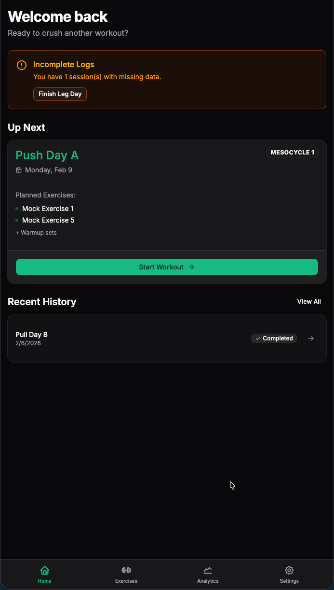

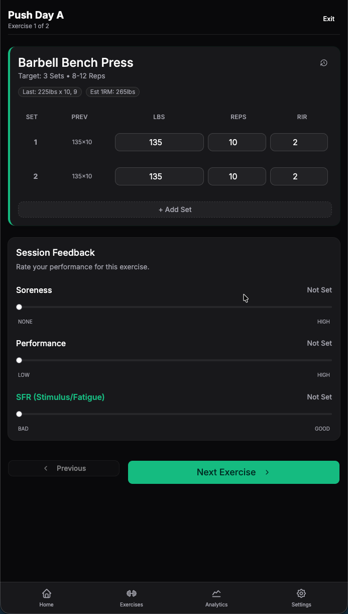

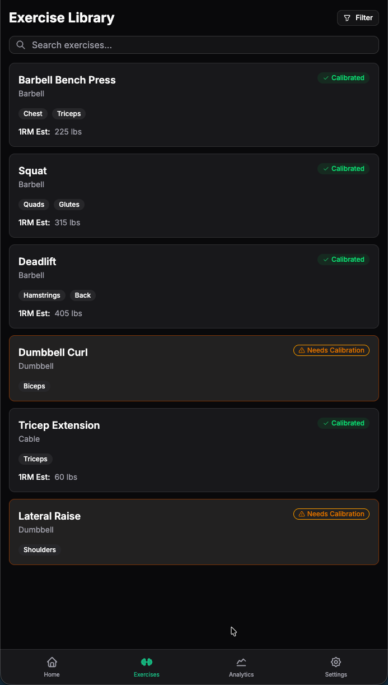

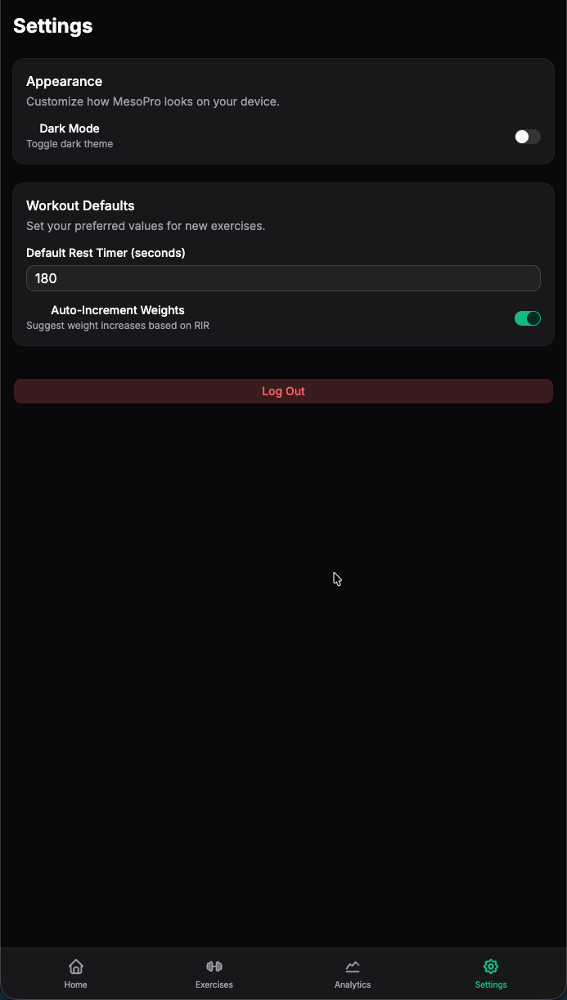

### Idea / Iteration 3 (GPT-5.2)

Open / Close 

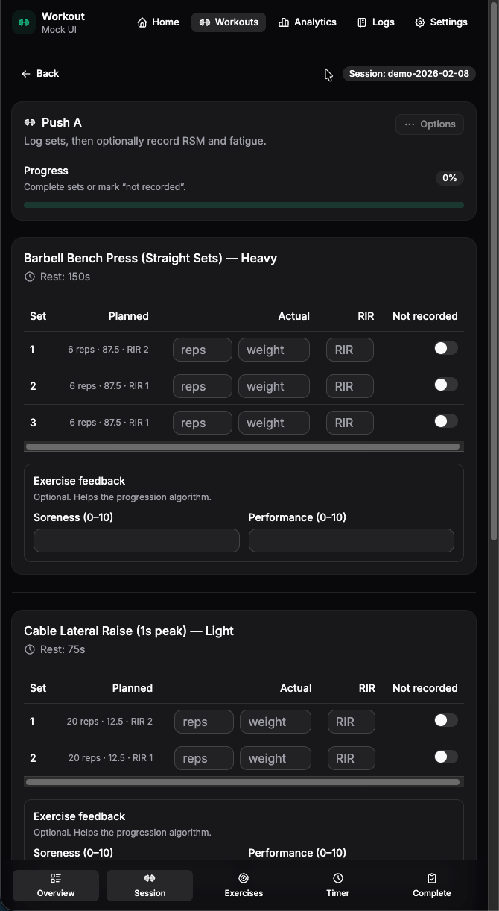

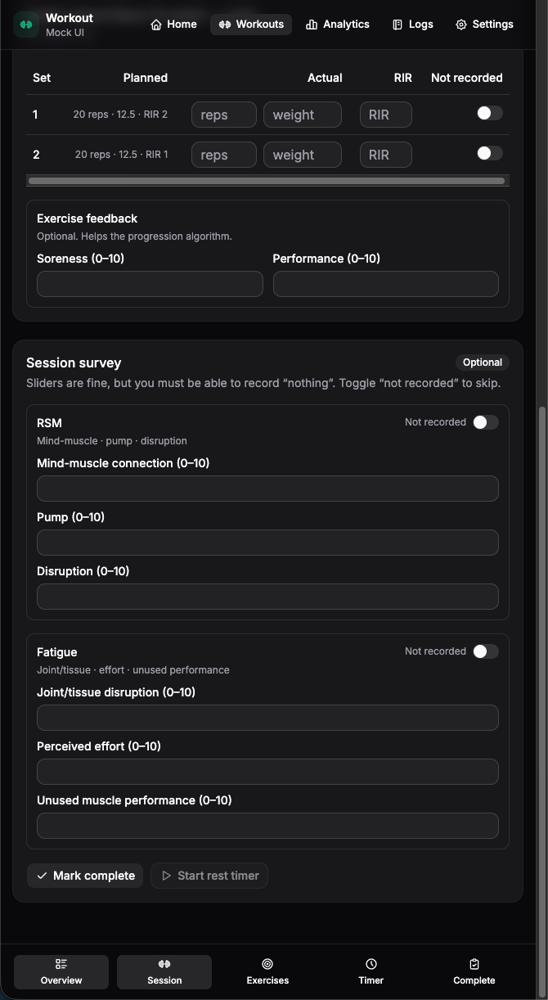

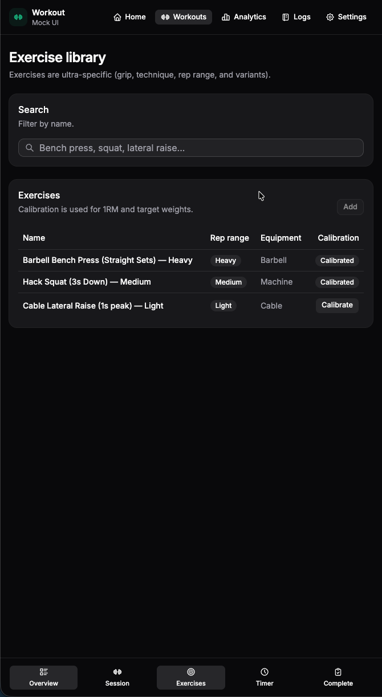

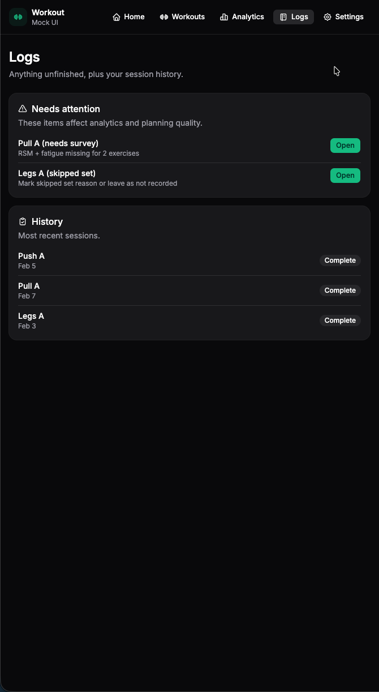

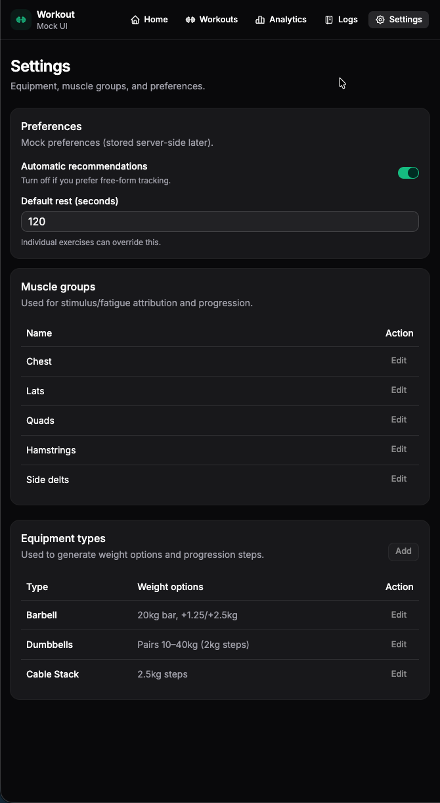

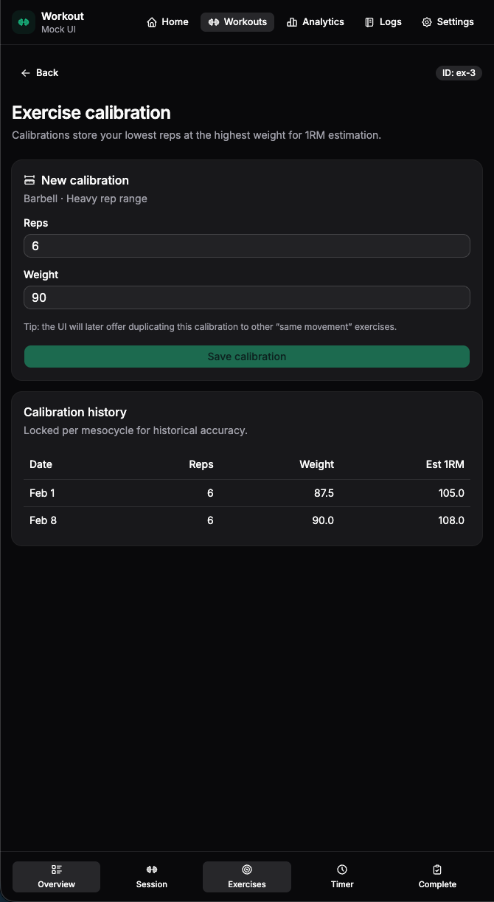

### Idea / Iteration 2 (Gemini 3 Pro)

Open / Close 

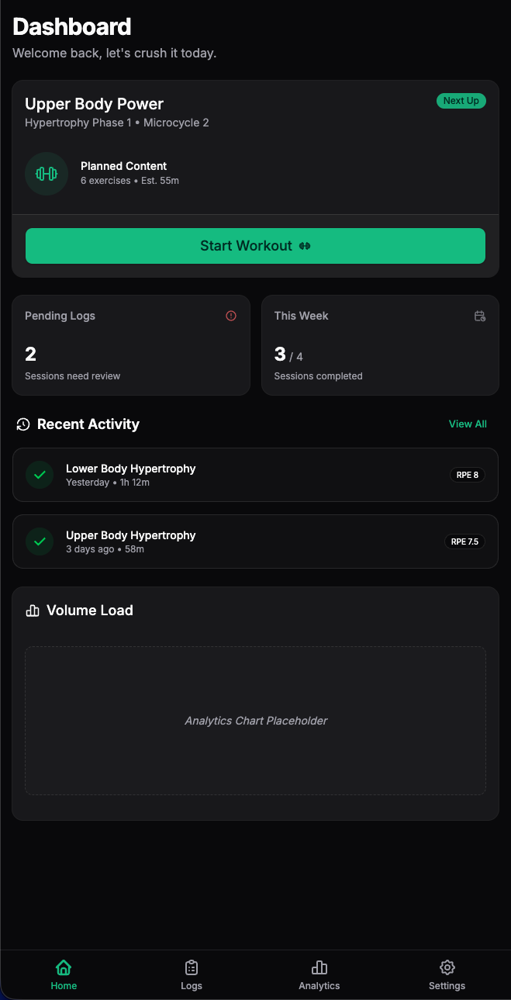

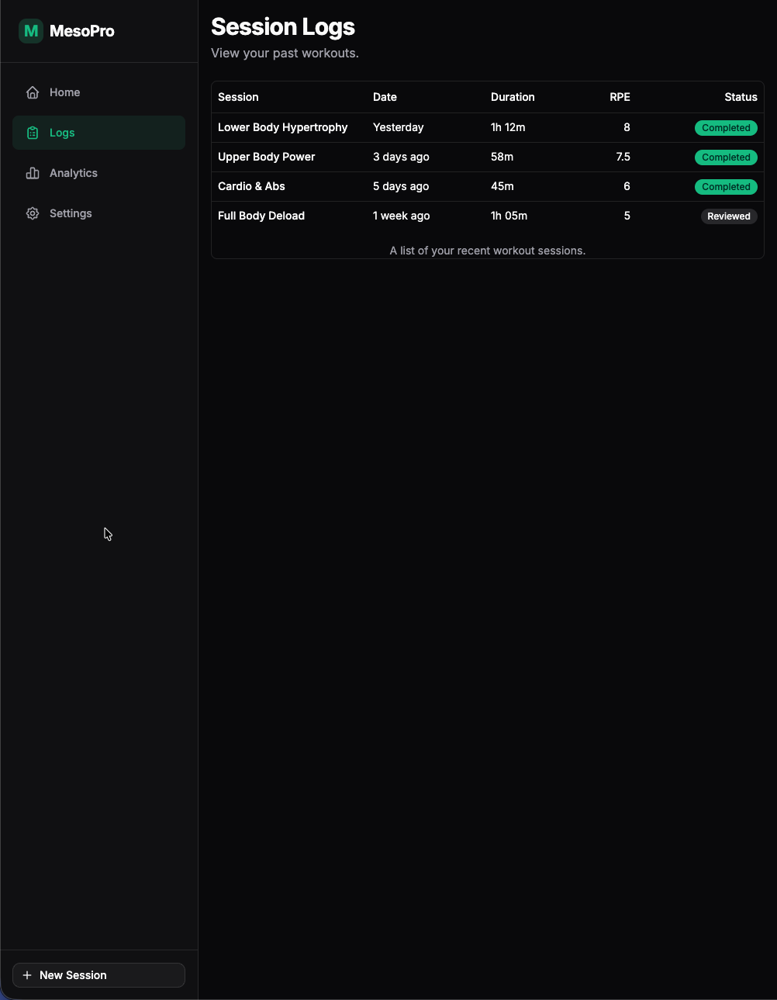

### Idea / Iteration 1

Open / Close 

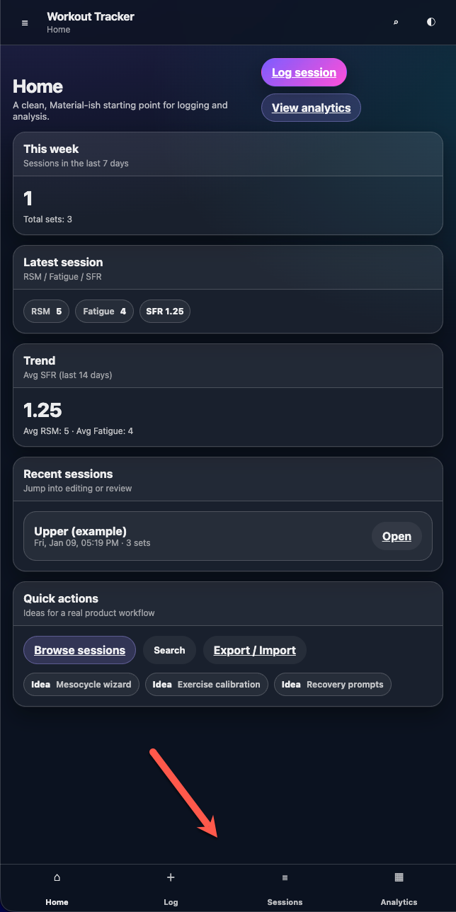

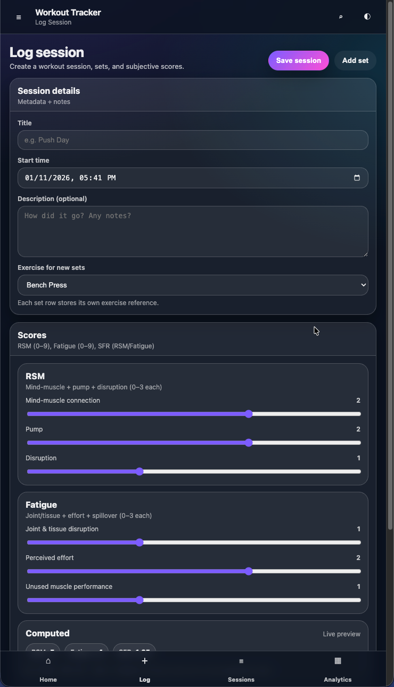

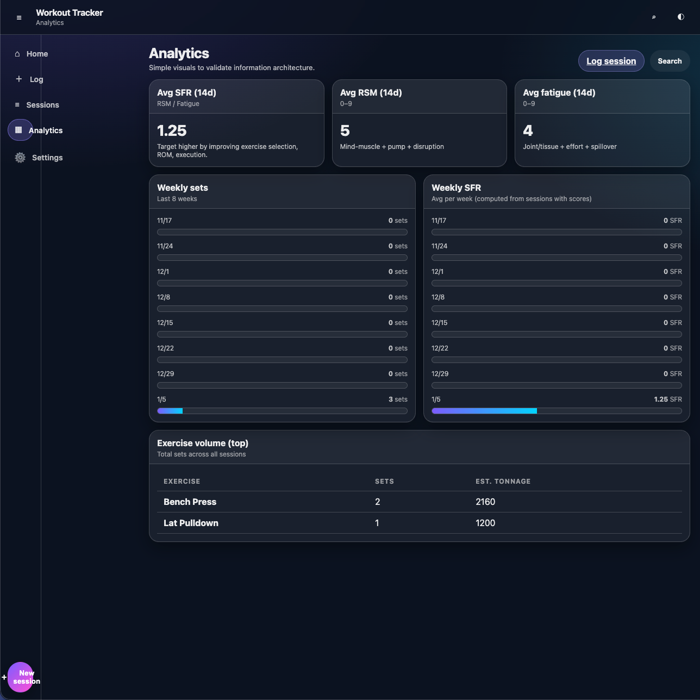

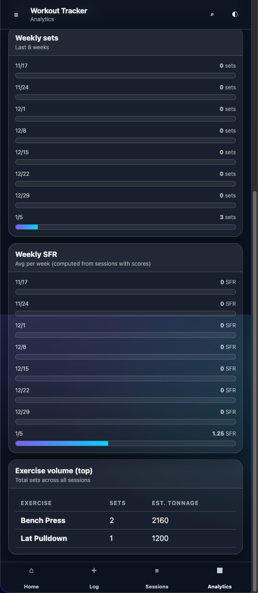

